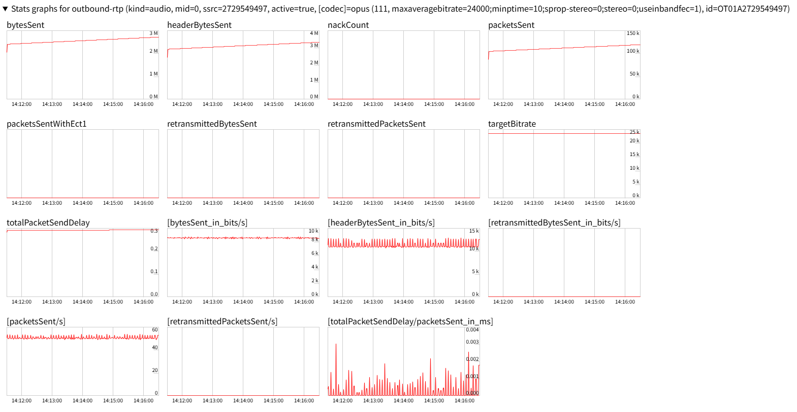
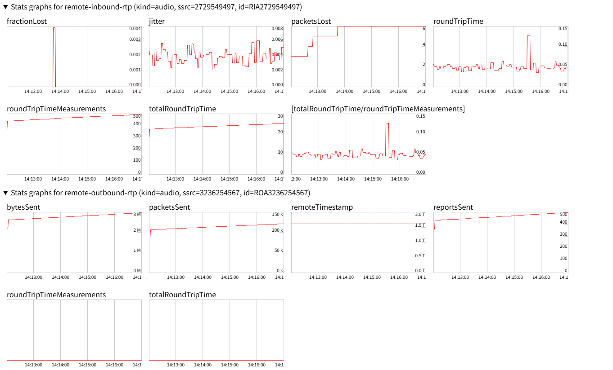

# WebRTC通信量分析レポート

検証日: 2026-01-22

## 概要

Opus DTX無効化後の無音時通信量を `chrome://webrtc-internals` で実測し、30GB SIMの持続日数を算出した。

---

## 検証環境

- **コーデック**: Opus
- **設定**: `maxaveragebitrate=24000;sprop-stereo=0;stereo=0;useinbandfec=1`
- **DTX**: 無効（一部端末で音声途切れが発生したため）
- **FEC**: 有効

---

## 送信統計（outbound-rtp）



### コーデック設定確認

```
opus (111, maxaveragebitrate=24000;minptime=10;sprop-stereo=0;stereo=0;useinbandfec=1)
```

### 無音時のリアルタイム送信量

| 指標 | 値 | 意味 |
|------|-----|------|
| bytesSent_in_bits/s | ~8-10 kbps | 音声ペイロード |
| headerBytesSent_in_bits/s | ~10-15 kbps | RTP/UDPヘッダー |
| packetsSent/s | ~50-60 pps | 20ms間隔で送信 |
| retransmittedBytesSent | 0 | 再送なし |
| retransmittedPacketsSent | 0 | 再送なし |
| targetBitrate | ~24k | 設定通り |

**合計: 約18-25 kbps（無音時）**

---

## ネットワーク品質統計



### remote-inbound-rtp（受信側から見た品質）

| 指標 | 値 | 評価 |
|------|-----|------|
| fractionLost | 0.2-0.4% | 非常に低い（良好） |
| jitter | 2-8 ms | 良好 |
| packetsLost | 0-6個 | ほぼなし |
| roundTripTime | 50-150 ms | 許容範囲 |

### 品質基準との比較

| 指標 | 実測値 | VoIP推奨値 | 判定 |
|------|--------|-----------|------|
| パケットロス | 0.2-0.4% | < 1% | ✅ OK |
| ジッター | 2-8 ms | < 30 ms | ✅ OK |
| RTT | 50-150 ms | < 200 ms | ✅ OK |

---

## 通信量計算

### 実測値ベース

```
無音時実測: ~20 kbps（音声 + ヘッダー）
= 20,000 bits/s
= 2,500 bytes/s
= 2.5 KB/s
```

### 時間あたりの通信量

| 期間 | 通信量 |
|------|--------|
| 1分 | 150 KB |
| 1時間 | 9 MB |
| 8時間 | 72 MB |
| 24時間 | 216 MB |

---

## 30GB SIMの持続日数

| 使用パターン | 1日あたり | 30GB持続 |
|-------------|----------|----------|
| 常時接続（24h） | ~216 MB | **約138日（4.5ヶ月）** |
| 1日12時間接続 | ~108 MB | **約277日（9ヶ月）** |
| 1日8時間接続 | ~72 MB | **約416日（1年以上）** |

---

## DTXとの比較

| 設定 | 無音時ビットレート | 30GB持続（24h接続） |
|------|-------------------|---------------------|
| DTX無効（現在） | ~20 kbps | 約138日 |
| DTX有効 | ~0.5 kbps | 約2,700日（理論値） |

**注意**: DTXは一部端末で音声途切れを引き起こすため無効化している。20 kbpsでも実用上十分軽量。

---

## 結論

1. **帯域効率**: 無音時~20kbpsはモバイル回線で全く問題ないレベル
2. **ネットワーク品質**: パケットロス0.2-0.4%、ジッター2-8msは非常に良好
3. **安定性**: 再送が0で回線品質が良い
4. **実用性**: 30GB SIMで4ヶ月以上持続可能

**推奨**: 現在の設定（DTX無効、FEC有効、24kbps制限）を維持

---

## 参考: chrome://webrtc-internals の使い方

1. Chromeで `chrome://webrtc-internals` を開く
2. 別タブでWebトランシーバーに接続
3. 接続（水色ハイライト）をクリック
4. `Stats graphs for outbound-rtp` セクションを展開
5. `bytesSent_in_bits/s` でリアルタイムビットレートを確認
