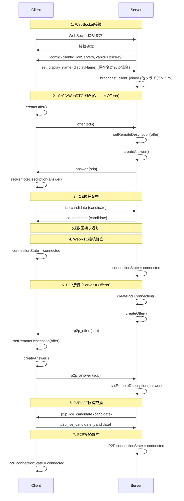
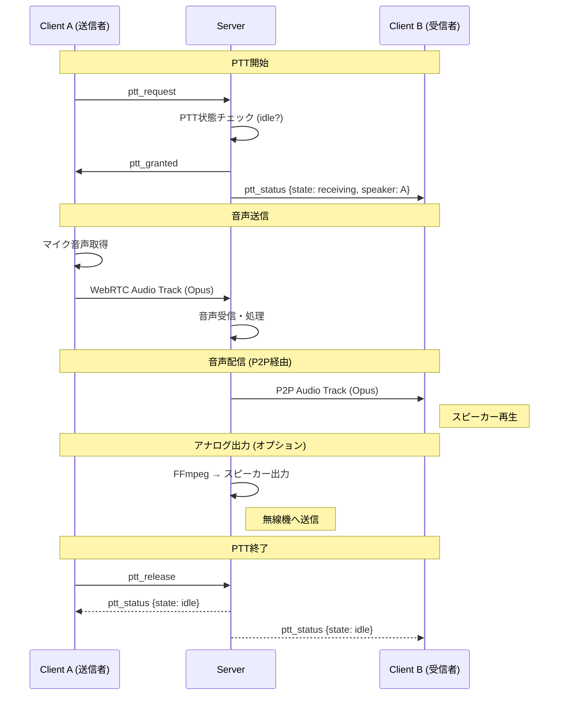
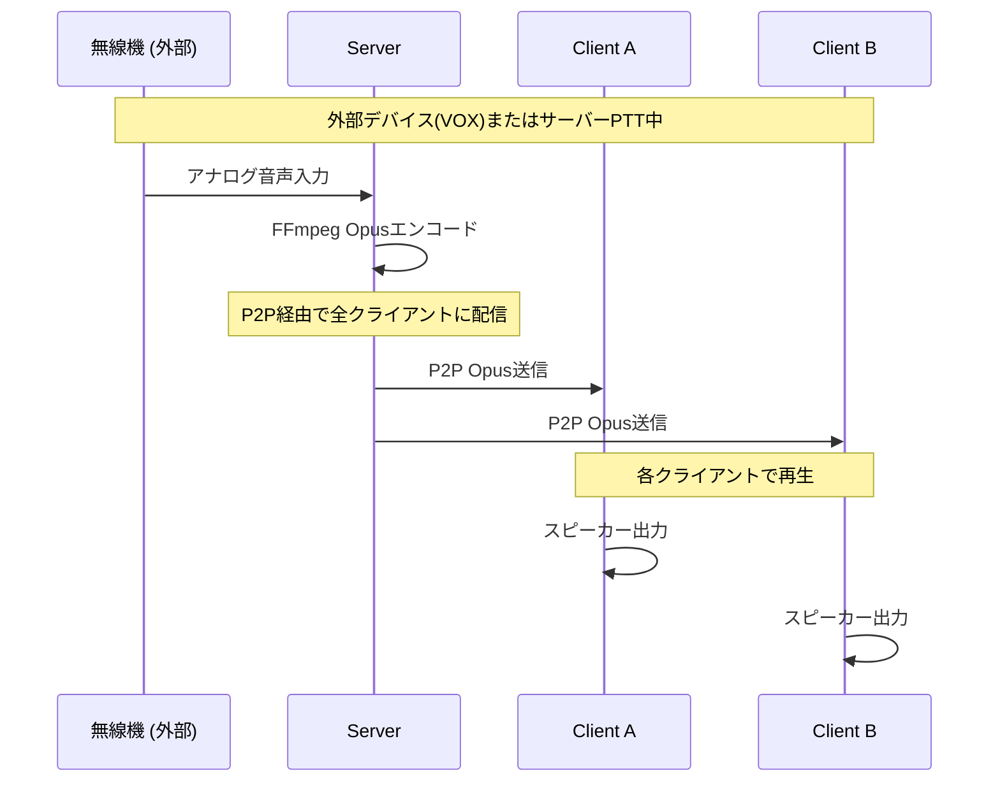
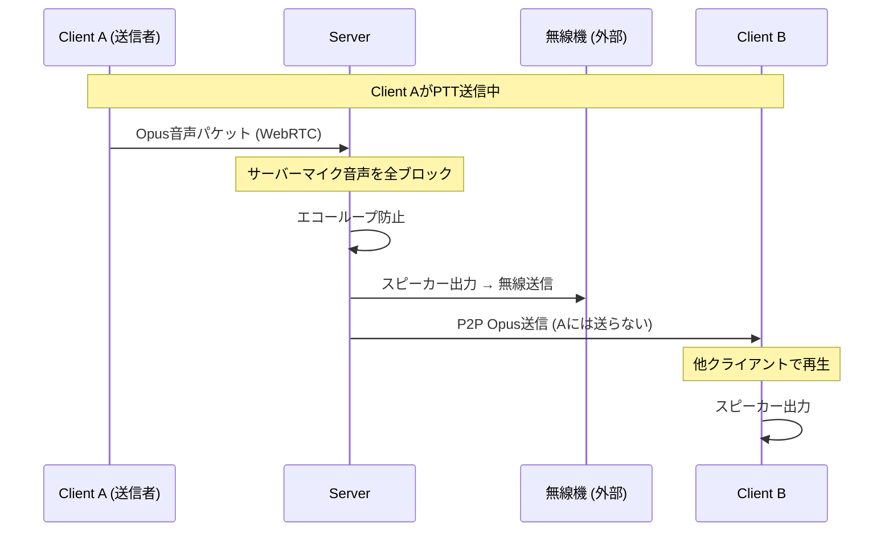
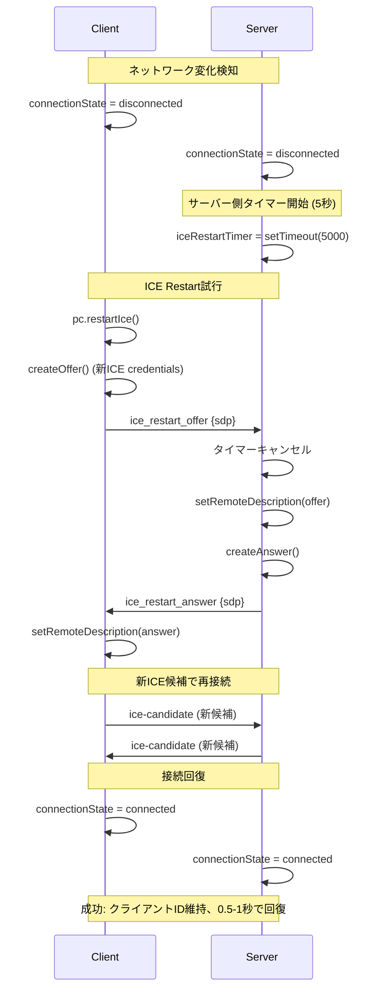
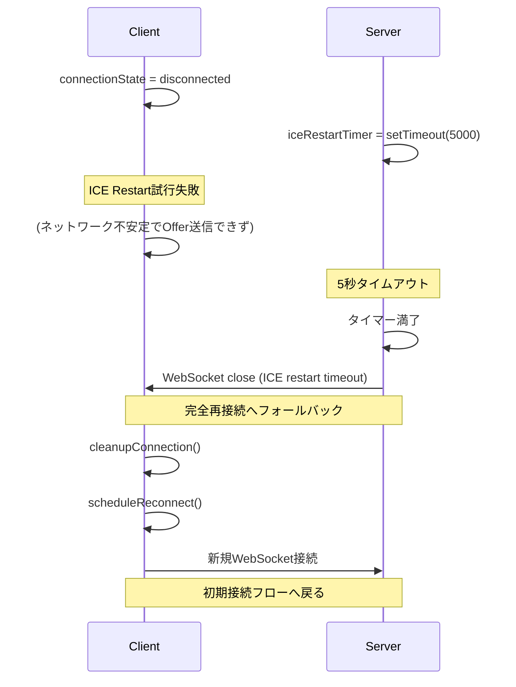
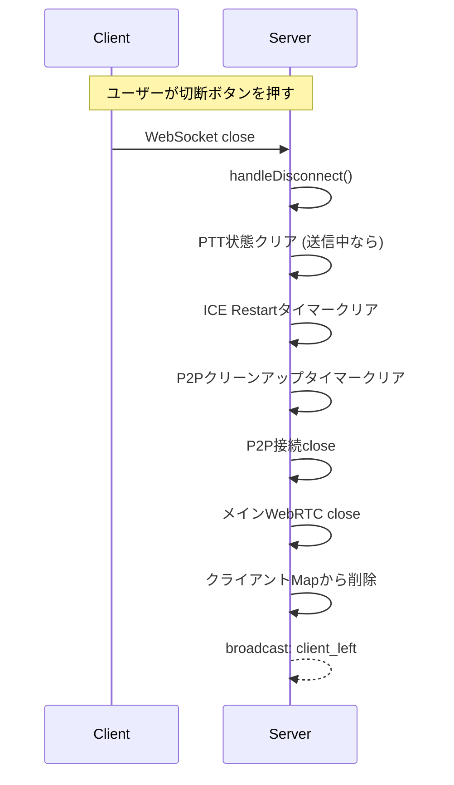
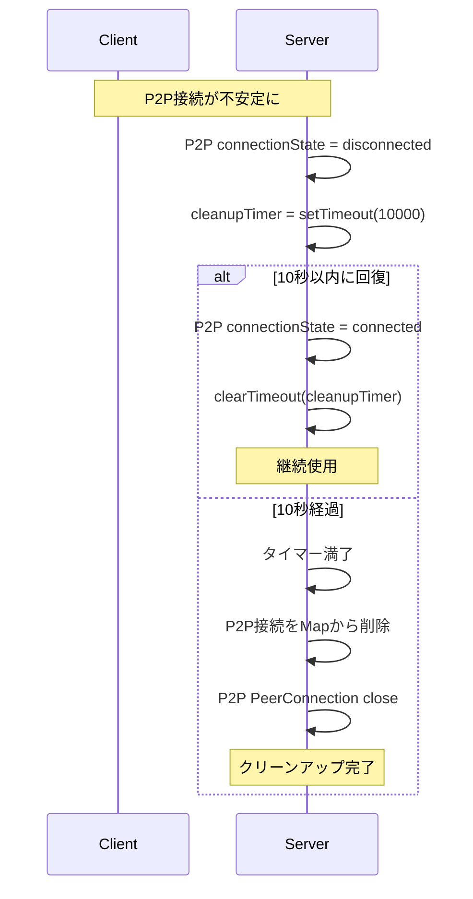

# PTT WebRTC通信シーケンス図

このドキュメントでは、PTTシステムの主要な通信フローをシーケンス図で説明します。

---

## 目次

1. [システム構成](#システム構成)
2. [初期接続フロー](#初期接続フロー)
3. [PTT送信フロー](#ptt送信フロー)
4. [P2P音声配信フロー](#p2p音声配信フロー)
5. [ICE Restartフロー](#ice-restartフロー)
6. [切断・クリーンアップフロー](#切断クリーンアップフロー)

---

## システム構成

```
┌─────────────┐     ┌─────────────┐     ┌─────────────┐
│  Client A   │     │   Server    │     │  Client B   │
│  (スマホ)    │     │  (Node.js)  │     │  (スマホ)    │
└──────┬──────┘     └──────┬──────┘     └──────┬──────┘
       │                   │                   │
       │◄─── WebSocket ───►│◄─── WebSocket ───►│
       │                   │                   │
       │◄─── WebRTC ──────►│◄─── WebRTC ──────►│
       │   (メイン接続)      │   (メイン接続)      │
       │                   │                   │
       │◄─── P2P接続 ─────►│◄─── P2P接続 ─────►│
       │   (音声受信用)      │   (音声受信用)      │
```

### 接続の役割

| 接続 | 方向 | 用途 |
|------|------|------|
| WebSocket | 双方向 | シグナリング、PTT制御、状態通知 |
| メインWebRTC | Client → Server | クライアント音声送信 |
| P2P接続 | Server → Client | サーバーからの音声配信 |

---

## 初期接続フロー



---

## PTT送信フロー



### PTT状態遷移

```
        ptt_request (granted)
idle ─────────────────────────► receiving
  ▲                                  │
  │                                  │
  │         ptt_release              │
  └──────────────────────────────────┘
```

---

## P2P音声配信フロー

### パターン1: サーバーマイク/外部デバイス(VOX)の音声配信



### パターン2: Webクライアントの音声送信



### エコー防止ロジック

```javascript
sendOpusToClients(opusData) {
    const currentSpeaker = this.pttManager.currentSpeaker;

    // WebクライアントがPTT中は、サーバーマイク音声を一切送信しない
    // (スピーカー出力 → 無線機マイク → サーバーマイク のエコーループ防止)
    if (currentSpeaker &&
        currentSpeaker !== this.serverClientId &&
        currentSpeaker !== 'external') {
        return;  // 早期リターンで全送信をブロック
    }

    for (const [clientId, connInfo] of this.p2pConnections) {
        // 送信者には送らない（自分の声が戻るのを防ぐ）
        if (currentSpeaker === clientId) continue;

        connInfo.audioTrack.writeRtp(rtpBuffer);
    }
}
```

### エコー防止の動作一覧

| PTT状態 | サーバーマイク音声 | 理由 |
|---------|-------------------|------|
| idle | ✅ 全員に送信 | 通常動作 |
| external (VOX) | ✅ 全員に送信 | 無線受信音声を配信 |
| server | ✅ server以外に送信 | サーバーPTT |
| Webクライアント | ❌ 全ブロック | エコーループ防止 |

---

## ICE Restartフロー

モバイル端末の移動時などにWebRTC接続が切断された場合、完全再接続ではなくICE Restartで高速回復を試みます。



### ICE Restart失敗時のフォールバック



---

## 切断・クリーンアップフロー

### 正常切断



### P2P Disconnectedタイムアウト



---

## メッセージ一覧

### WebSocket メッセージ (Client → Server)

| type | 説明 | パラメータ |
|------|------|-----------|
| set_display_name | 表示名設定 | displayName |
| offer | WebRTC Offer | sdp |
| ice-candidate | ICE候補 | candidate |
| ice_restart_offer | ICE Restart Offer | sdp |
| p2p_answer | P2P Answer | sdp |
| p2p_ice_candidate | P2P ICE候補 | candidate |
| ptt_request | PTT取得要求 | - |
| ptt_release | PTT解放 | - |
| push_subscribe | Push通知登録 | subscription |

### WebSocket メッセージ (Server → Client)

| type | 説明 | パラメータ |
|------|------|-----------|
| config | 初期設定 | clientId, iceServers, vapidPublicKey |
| answer | WebRTC Answer | sdp |
| ice-candidate | ICE候補 | candidate |
| ice_restart_answer | ICE Restart Answer | sdp |
| p2p_offer | P2P Offer | sdp |
| p2p_ice_candidate | P2P ICE候補 | candidate |
| ptt_granted | PTT許可 | - |
| ptt_denied | PTT拒否 | reason, speakerName |
| ptt_status | PTT状態通知 | state, speaker, speakerName |
| client_list | クライアント一覧 | clients[] |
| client_joined | クライアント参加 | clientId, displayName |
| client_left | クライアント離脱 | clientId |

---

## タイムアウト値一覧

| 項目 | 値 | 説明 |
|------|-----|------|
| ICE Gathering (メイン) | 3秒 | srflx候補取得後の待機 |
| ICE Gathering (P2P) | 2秒 | P2P用ICE収集 |
| ICE Restart (サーバー) | 5秒 | Offer待機タイムアウト |
| ICE Restart (クライアント) | 5秒 | 回復待機タイムアウト |
| P2P Cleanup | 10秒 | disconnected後のクリーンアップ |
| PTT Timeout | 5分 | 長時間送信防止 |
| WebSocket Heartbeat | 30秒 | 接続維持ping間隔 |

---

## Opusコーデック設定

```javascript
// SDP内のOpusパラメータ
stereo=0              // モノラル
sprop-stereo=0        // 受信側もモノラル
useinbandfec=1        // FEC有効（パケットロス対策）
maxaveragebitrate=24000  // 24kbps制限
// usedtx=1           // DTX無効（一部端末で問題発生）
```

---

## 関連ドキュメント

- [implementation-notes.md](implementation-notes.md) - 実装の詳細知見
- [bandwidth-analysis.md](bandwidth-analysis.md) - 通信量分析
